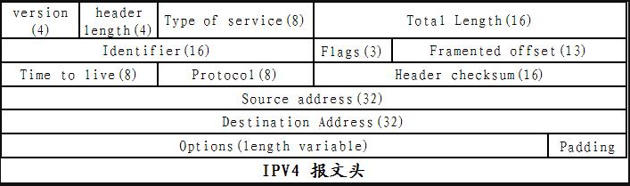

### 参考代码链接
https://blog.csdn.net/CSDN___LYY/article/details/79461026

**定时**备份参考

https://blog.csdn.net/fish332/article/details/114178510

（建议搜索：java文件备份）文件备份参考

IPv4报文

### 参考库

1. 前端GUI：swing
2. 定时：Timer.SheduleAtFixedRate
3. 读取文件：io
4. 

### 开发进度
1. v1: 基本的GUI界面、备份和恢复函数 done

   v1.1: GUI界面的优化: 
2. 

### 技术栈
1. 将指定目录下的文件全部备份到**一个文件**中 (done)
2. 将备份件**还原**为原本的目录树 (done)
3. 对备份文件进行**加密、解密**
4. 对备份文件进行**打包、解包**
5. 对**元数据**进行处理
5. 对目录树下的文件进行**筛选**
6. **周期性**备份和**数据淘汰**的**设置**
7. 感知用户**文件变化**，进行自动备份
8. **jsonPath可以学习，用于筛选过程**
9. 开发GUI界面 (basically done)
10. https://blog.csdn.net/Cguoer/article/details/122588595 (java实现循环校验CRC)

### 现存问题
1. 各种exception之间的逻辑关系（基本放弃解决）
2. 对所有的文件备份，使用cyc循环校验
3. 将文件切分成块的形式
4. 

### 附加要求
1. 完成cyc循环校验（必备）
2. 打包解包：注意**目录也是文件！！！** 一定要实现分块化处理。
3. 压缩：实现Huffman编码和LZ77编码。其中Huffman编码可以在压缩过程中使用字符串的形式，但是在存储和恢复过程中要使用byte
建议直接存储哈夫曼树用于后续解码。

LZ77编码中，内存不可能一直朝一个方向无限扩展，如何处理？ -> 移动内容（丢失历史窗口且缓慢）；循环缓冲（可以加分）
4加密解密：使用AES加密，但不能是简单的异或，最好可以使用CBC模式（加分）
5封装成库：使程序的核心逻辑与界面实现分离